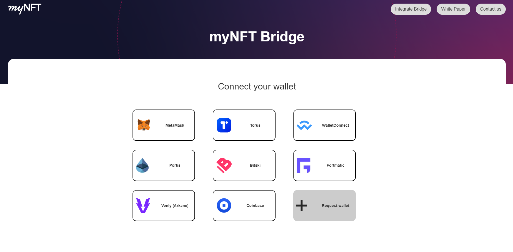
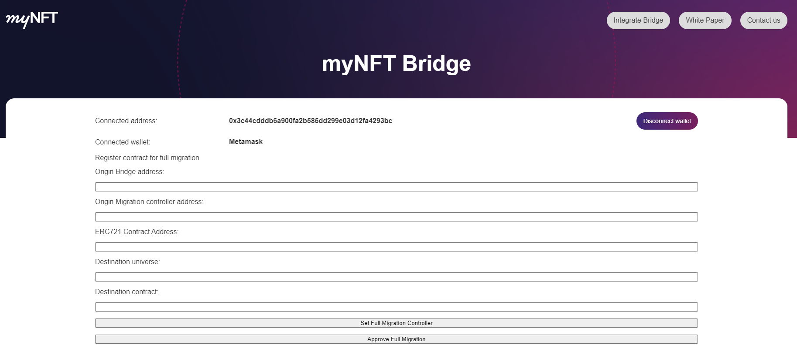
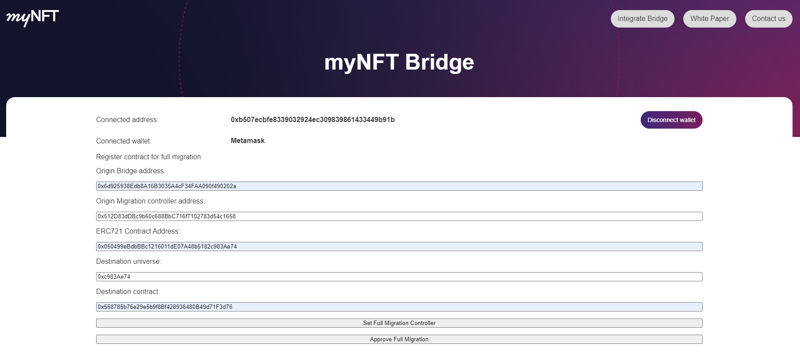

# Full migration

## AGo to the url of the relay and connect your wallet.

## On the next page, complete the form:
- **Origin Bridge address:**  brige address in the origin network (0x5F201e815EBBA0AD9a785cb491D3479bb8AFc7D4)
- **Origin Migration controller address:** Address of the migration controller can use this one (0x512D83dDBc9b60c688BbC716f7102783d54c1658)
- **ERC721 Contract Address:**  ERC721 token contract address to migrate in the origin network
- **Destination universe:**  Destination network ID
- **Destination contract:**  ERC721 token contract address to migrate in the destination network

## With all the fields completed, click on the set full migration controller button

## Metamask notification will appear, confirm the transaction. This registers the migration controller in the origin bridge
## After that, click Approve Full Migration button and confirm the transaction that popup in Metamask. Once confirmed the full migration to the destination nerwork would be allowed.

