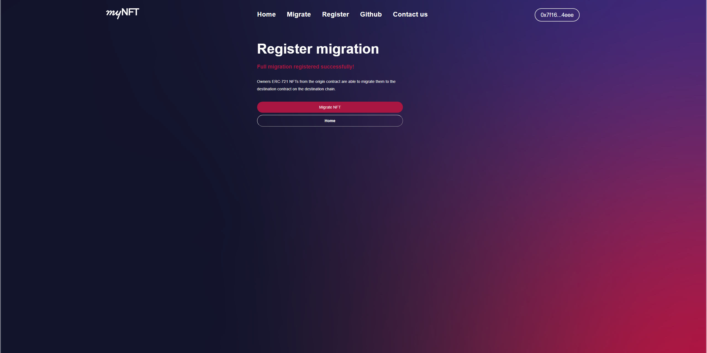

# Register and approve a full migration

## First you need to go on https://bridge.mynft.com/.

## Choose Register full migration:

## Select the wallet

## On your destination token contract register the mapulator address ad minter, then click next 

## Choose the origin network if it is not already selected

## Fill your NFT contract address:

## Select destination network

## Metamask will request to change networks

## Fill your NFT contract address:

## Change back to the origin network and metamask will ask to deploy the migration controller, confirm the transaction

## Register the deployed contract and the approval to do a full migration on the bridge

## Then full migration register process is complete

