# Migrate a NFT to an IOU

## First you need to go on https://bridge.mynft.com/.

## Choose Migrate NFT:
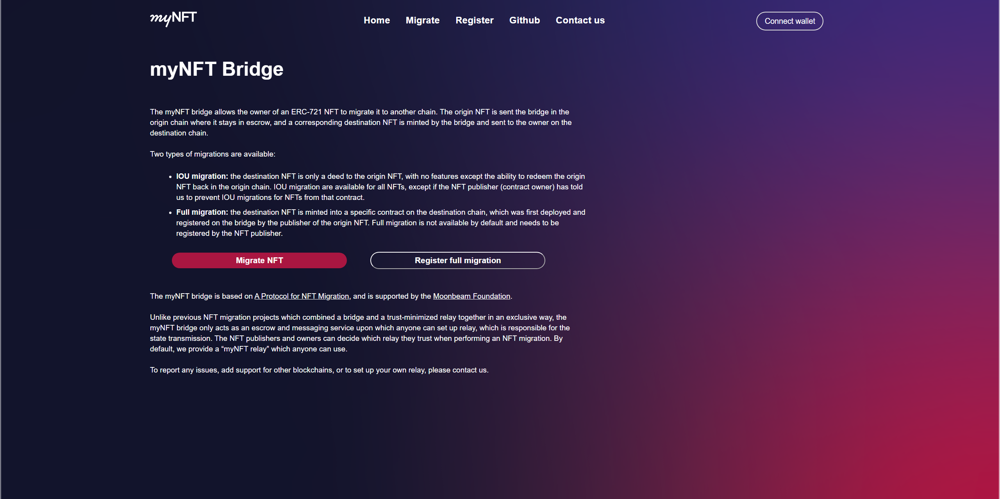
## Select the wallet

## Choose the origin network if it is not already selected
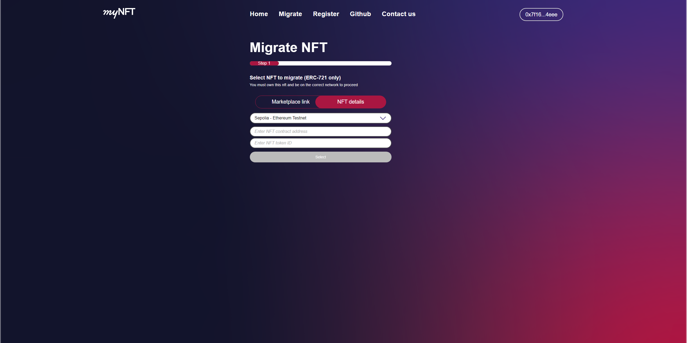
## Fill your NFT contract address and token id:
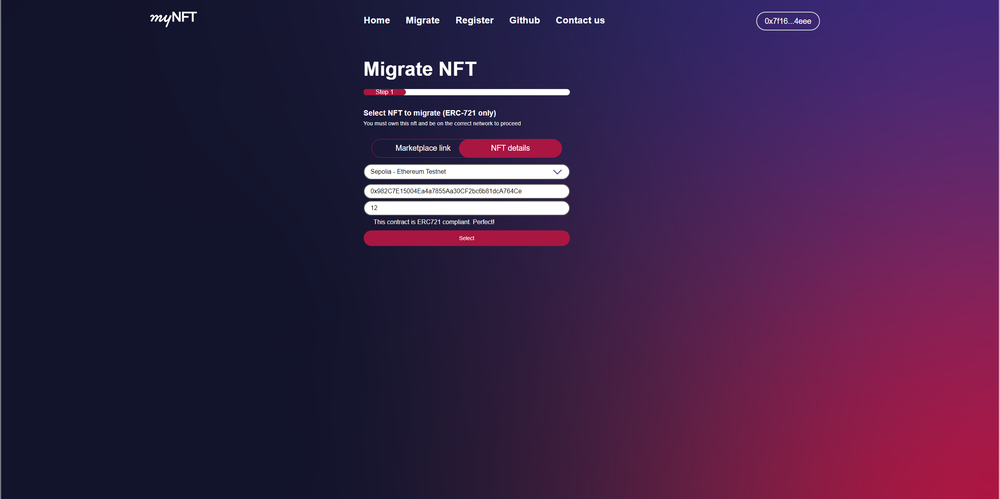
## Confirm the information of the NFT to migrate
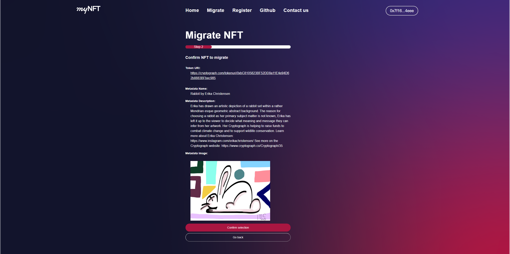
## Select destination network
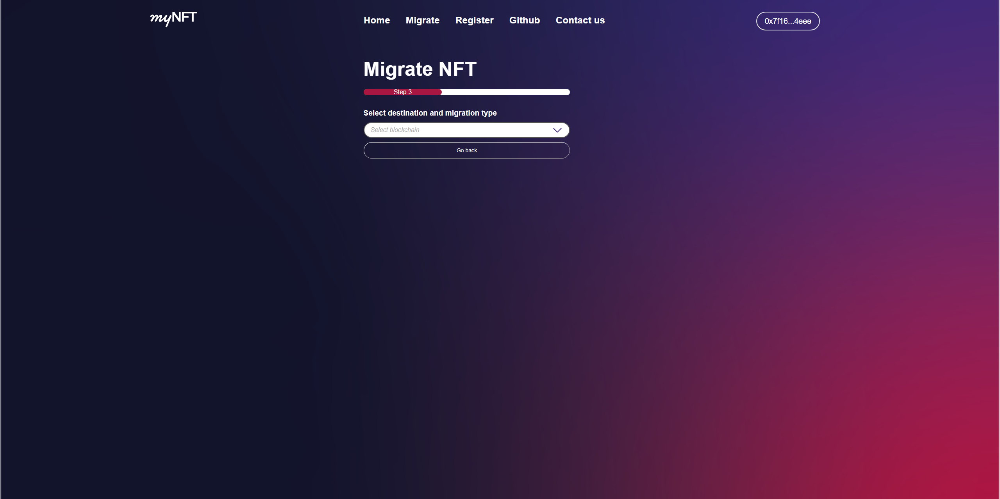
## Review the information of the migration
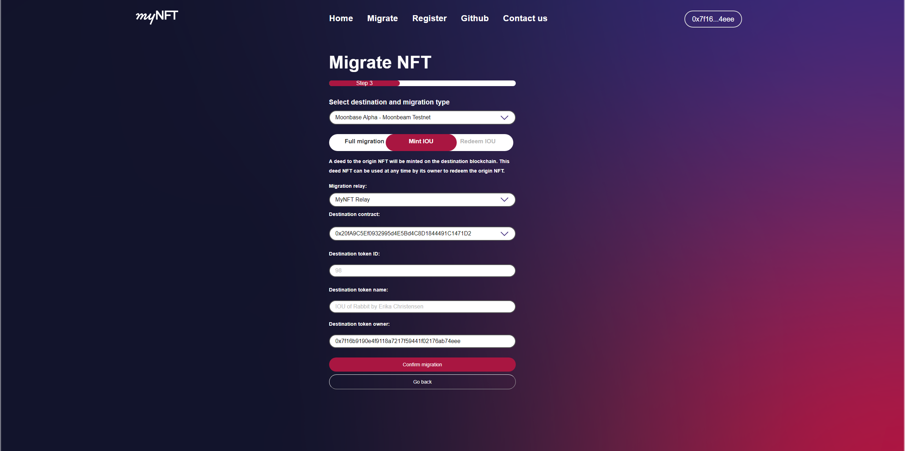
## This page is a recapitulative of the informations you filled in. Click register.
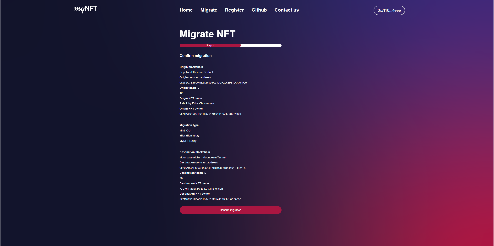
## Allow the relay to transfer your NFT

## The relay is being approved as an operator of your NFT
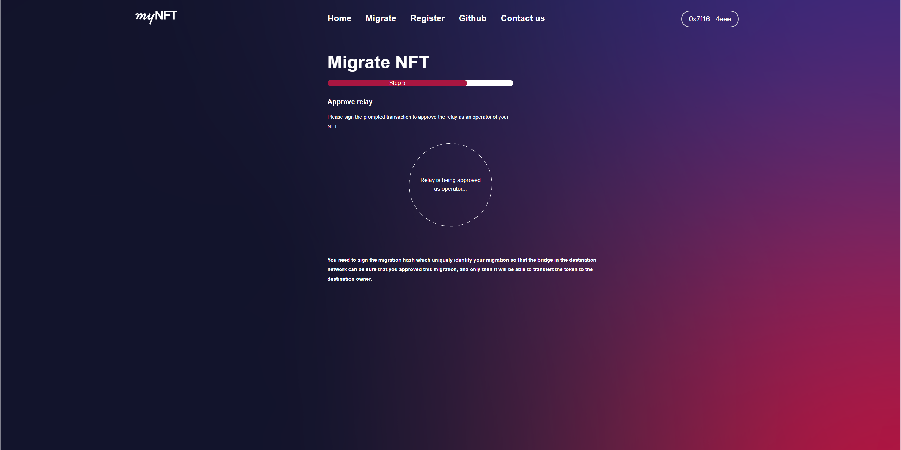
## Then the migration process start. First, registering the migration on the origin bridge
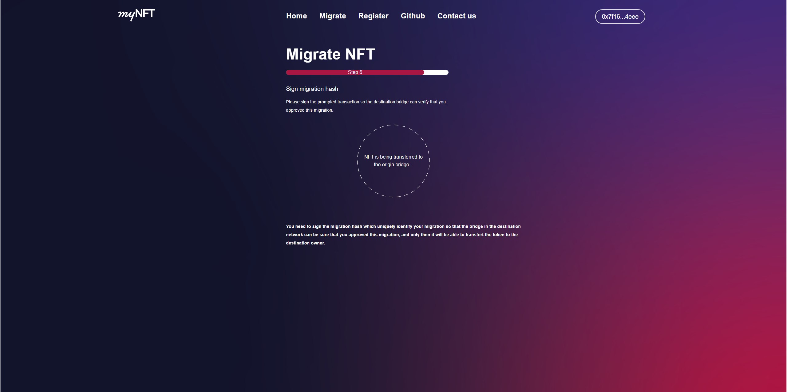
## The origin bridge emit a migration hash, you need to sign it to continue

## The relay is minting your IOU token
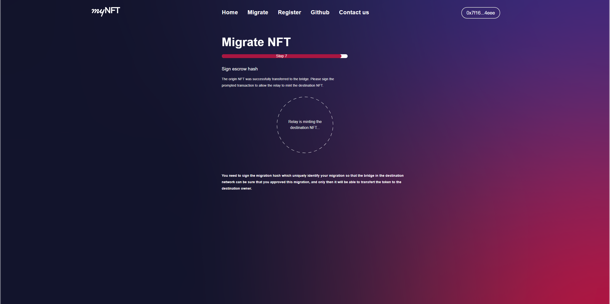
## Migration complete ! You now own a IOU NFT token, and can use it as you please. 
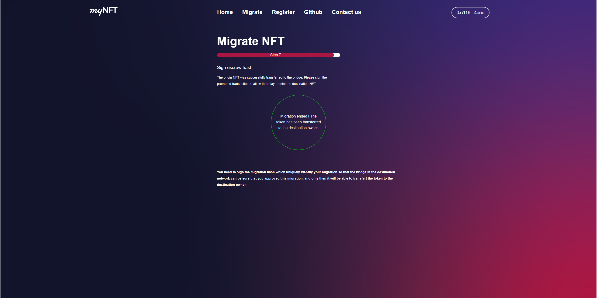
## The informations about it are displayed, and you can recover the original token when you want through the same process.
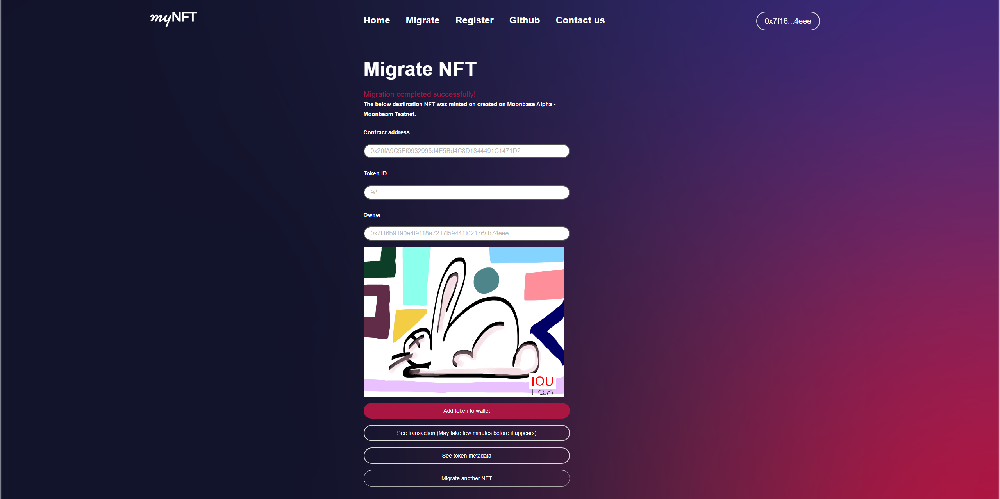
